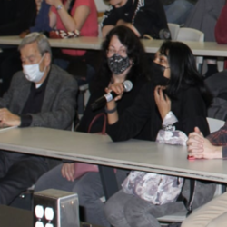

 Sean Carroll 

## on: [*The Many World of Quantum Physics*](https://www.preposterousuniverse.com/blog/2014/06/30/why-the-many-worlds-formulation-of-quantum-mechanics-is-probably-correct/)
> Physicist [Sean Carroll](https://www.preposterousuniverse.com/), from CalTech, gave a guest lecture [here at my university!!](https://www.facebook.com/ubphysics/photos/pcb.6325105130896296/6325099690896840)
> ***

 I asked him.... 

> many questions but my favorite pick is: *"why the universe is thought to be symmetric?"* and he said..

>>
       "it doesn't have to be!"

  
