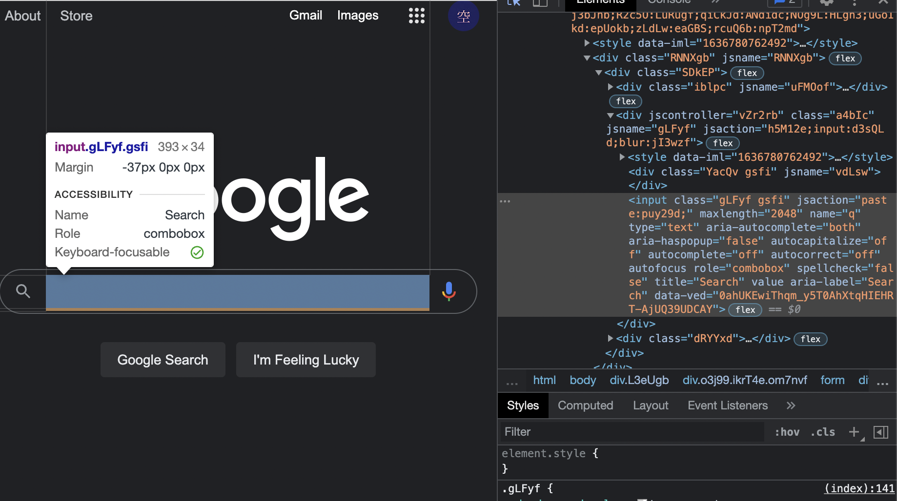

<details>
<summary> so you have to register for classes at 7:00am... </summary>

## Let python do it for you with Selenium

[](https://selenium-python.readthedocs.io/installation.html)

Selenium is a web scraping tool that beautifully integrates with python. It allows you to automate webpage interactions.

I stumbled across it a while ago, but I had not used the actual API until recently. Long story short, I had to make a doctor's appointment right at 12am to even find a spot (thank you American healthcare system!).

Regardless, whether it be to automate time sensitive actions or long and arduous form filling, Selenium is here for your rescue. I will go over a few useful Selenium methods that should equip you with basic webpage interactions.

> Note: these methods work as of November 2021

### Useful Selenium methods

---

`service.start()`

This [method](https://www.selenium.dev/selenium/docs/api/rb/Selenium/WebDriver/Service.html) allows to set up a browser driver.

I personally used the chrome driver:

```python
from selenium import webdriver

from selenium.webdriver.chrome.service import Service

service = Service('/path/to/chromedriver')

service.start()
```

> You will have to locally install the 'chromedriver' executable. You can install it and find more usage examples [here](https://chromedriver.chromium.org/getting-started).

---
`driver.get(url)`

Once you have the browser all set up, you can connect to it remotely with Selenium using the .get method as follows:

```python
driver = webdriver.Remote(service.service_url)
driver.get('[insert url of page you want to selenium to work its magic on]')
```

And, that's the basic set up! You can now inspect element on the target webpage to figure out which fields you want to automate interaction with.

---

`driver.find_element`

Let's say, I want to automatically search something on Google. I would first figure out the class name/ID of the search bar using "inspect element":



Since there is only a class name of `gLFyf` attached, it would be used to select the search bar and insert a value to search using the code:

```python
searchbar = 'gLFyf'
driver.find_element(By.CLASS_NAME,searchbar).send_keys("[value to search]")
```

> The send_keys method can take an array as well to fit the format of the input field. Regardless of the type of input, " " are needed.

---

`actions`

Finally, you can make Selenium click the search button by repeating a similar process of finding the search button's class name/ID. Here's a sample snippet:

```python
submit = "gNO89b"
driver.find_element(By.CLASS_NAME, submit).click()
```

> A full list of different actions Selenium can perform can be found [here](https://selenium-python.readthedocs.io/navigating.html).

---

`driver.quit()`

Don't forget to close the automation process and the browser by using the quit method at the end!

---

#### Have fun with your newfound web super power.

> Tip: you can also schedule your python script to execute during specific times using [cron](https://wiki.archlinux.org/title/cron#Crontab_format)

</details>
