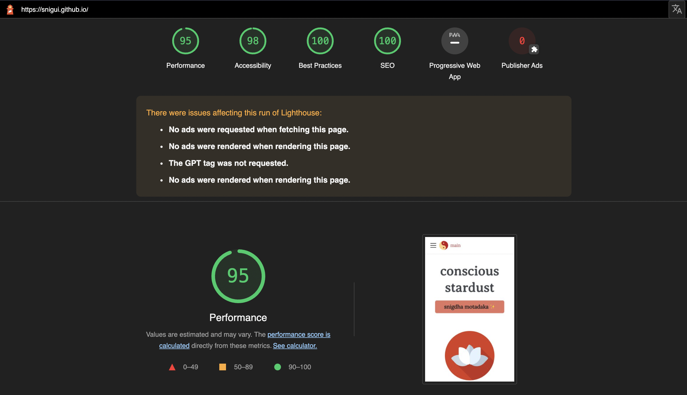

<details>
<summary> How to Properly Build a Website! </summary>

### From the seeimgly never-ending choices of webframeworks...
> what do you pick? how do you pick!


<details>
<summary>
Here's my take on things to do to build a website, easily

 

 </summary>

<details>
<summary>

### 1. Rendering pages, accessibly.

</summary>

   If anything, a website can be boiled down to "rendering pages with information". So, you gotta have that in place! To take it up a notch, however, an important ability is to render pages on different screens and formats (from accessible dictation enabled to translatable in multiple languages).


   As long as your pages are easily accessible to your target audience, your website is in a great position already!
</details>

<details>
<summary>

### 2. Setting in place an editable workflow

</summary>

   Unless the point of your website is a one time done deal where it is meant to be completely static, it might be useful to set up a predefined, well-staged workflow that you can recreate over and over again in order to make changes to your site efficiently!


   

   I personally use [Docusaurus](https://docusaurus.io/docs) Docusaurus to do the heavy-weight lifting of getting all of my posts sorted and displayed correctly (and prettily). The most I do is make a new blog post in the blog directory using Atom (and IDE) . Then I simply the run the commands to publish:

  ```python
  yarn build
  yarn deploy
  ```

  The initial set up might be tedious but it does pay off in the long run!


</details>

<details>
<summary>

### 3. Integrating with version control

</summary>


   

  Last time I wanted to make changes to my website, I had messed up the package.json file and couldn't get yarn to execute its handy scripts for the life of me.


  It then led me to a rabbit-hole of frustration and deletions where I ended up losing my entire project locally (I wish I knew how I messed up **that** bad!!). But, mishaps happen! The only saving light happened to be a random branch I had accidentally made on GitHub when I still had all the files in tact.


   

  Now, with that experience, I am a huge propagator of keeping track of almost all changes you make to your site using git (or your favorite version control system). Trust me, it is going to be a literal sanity saver.

</details>

<details>   
<summary>

### 4. Using as few frameworks as possible

</summary>

   

  I basically run this entire website using Docusaurus which helps me manage [React, Markdown](https://docusaurus.io/docs/markdown-features/react) and [Node](https://nodejs.org/en/knowledge/getting-started/npm/what-is-npm/). Docusaurus also has its own CSS styling tool called [Infima](https://infima.dev/) that standardizes all the themes on here, making things look simple and consistent! Of course, React makes my site very scalable (to the point that you can size down your browser to extremes and still not have most components act up and look horrible).


  In summary, pick a great framework that has all the needs of your website handled, all in one place, while also giving you the ability to completely take control over every component if needed.


   

  I have made a significant amount of additions and changes to the basic [Docusaurus](https://docusaurus.io/docs/playground) features by learning the specifics of the technologies it builds on!


  You will know you have picked a great framework if it lets you break it apart and take control over all the tools it uses, while also exposing you to these new tools, helping you learn!

</details>

<details>
<summary>

### 5. Hosting the site

</summary>

  It's not as fun if your website stays forever in localhost, never branching out into the world wide web! Again, an overwhelming number of site hosting solutions ranging from GoDaddy, WordPress and even some GUI based website builders such as Wix and Squaresite are out there for use.

  I am assuming, since you are reading this, you are tech savvy enough to not settle for pure GUI drag and drop website builders though (which is the best way to go in my personal opinion).  

  


  Just by learning a little bit of the basics of web hosting (and cloud services), you can host a pretty heavy-weight website for FREE on the interwebs. My webpage, as the name suggests, uses GitHub. [GitHub pages](https://docs.github.com/en/pages/getting-started-with-github-pages/about-github-pages) is very highly documented and has an active community (similar to Docusaurus). It makes it super simple for me to push changes for the world to see with a few simple command line inputs locally.


  Again, the initial research and getting used to will be very tedious, but once you do find the right hosting service, you will know you found THE ONE when it boils down to being super simple in the long run. Plus, I get a cool domain name without spending a single cent!

  I have seen other commercial hosting services purposefully give their users really ugly, long and gross default domain names to incentivize them to spend money for better ones.

  

  That would not be the case if you were to choose a cloud hosting service such as [DigitalOcean](https://www.digitalocean.com/solutions/website-hosting/), [GitHub pages](https://www.khanacademy.org/computing/computer-programming/html-css/web-development-tools/a/hosting-your-website-on-github), [Google Cloud](https://cloud.google.com/solutions/web-hosting) etc. (which do require you to know coding).


</details>

<details>
<summary>

### 6. Making the site visually appealing

</summary>

  Some go-to's to have on your site:

  - Scalable graphics
  - Collapsible sections
  - Minimal text blobs
  - Spacious layout

  

  This area is more subjective than not and does depend on your preferences. However, if you want to tune your site towards a general range of audience, the simpler and easier to use your website is, the better!

</details>

<details>
<summary>

### 7. Browser console debugging

</summary>

  In browser console's have really upped their game. Browsers such as Chrome, Firefox, [Brave](https://brave.com/) have an almost IDE like console!

  > ✨ Brave: I recently found out about. It is super cool and gives creators cryptocurrency. I will make another post all about crypto, next!


  For now, I wanted to mention about the tool named: "Lighthouse". This is a website auditing tool which conveniently fetches you a report on your site's performance and compliance with web and security standards.

  If anything, I would highly suggest any web dev out there to run their sites through Lighthouse at least once before deployment and take a note of the report!

  

  Here's a quick look at a report that was generated for this site (~~no bragging intended~~):

  

  If you expand the report, Lighthouse lays out all the details on what could be improved on your page, along with links to resources on building accessible, fast and reliable webpages! It is a great tool to truly delve deep into the world of web development.

  

</details>

I will leave it at these brief 7 ideas. Implementing them have personally helped me a lot in learning web development. Hopefully, these basic approaches can help you make a great website! And, good luck on centering that div!


</details>

</details>
