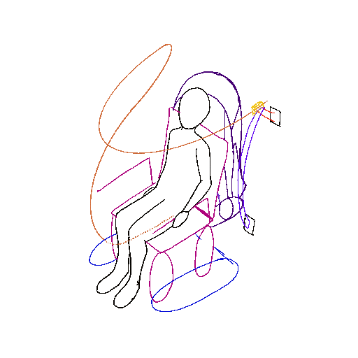
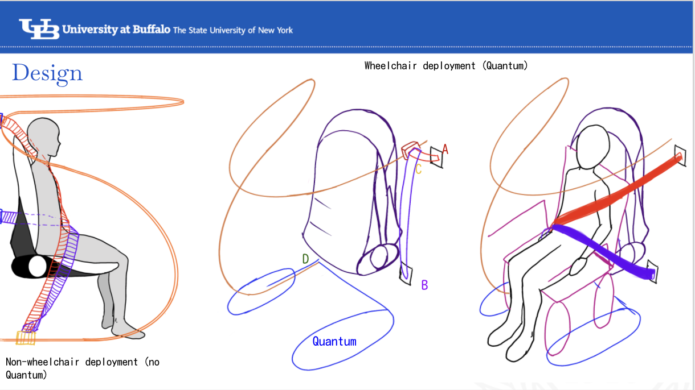
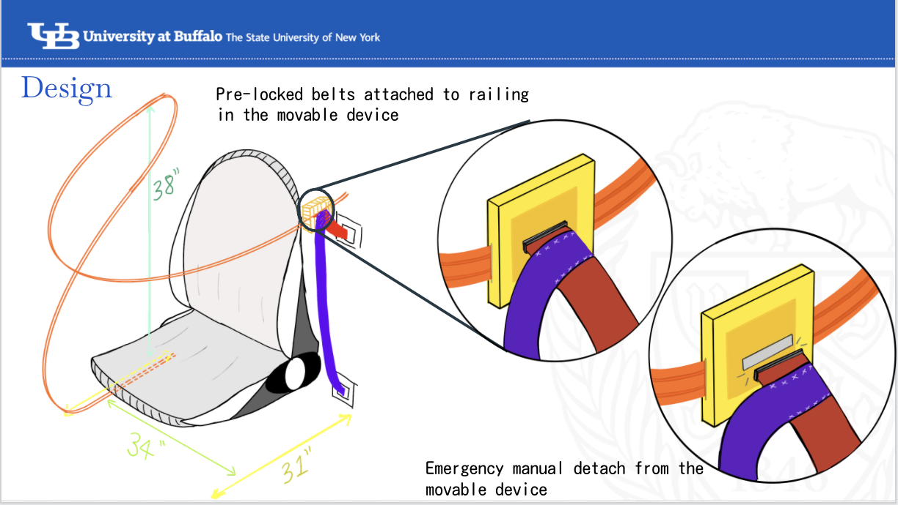

<details>
<summary> Pong! </summary>

```python
Best viewed in full browser
Click run and then the output tab
```

<iframe frameborder="0" width="100%" height="500px" src="https://replit.com/@SnigdhaMotadaka/pong?embed=true"></iframe>

</details>


<details>
<summary> GScript to Filter and Pick Data </summary>

** [github.com/snigui/gsheets_automatization](https://github.com/snigui/gsheets_automatization) **
> open source, feel free to contribute!

</details>


<details>
<summary> Ethereum ERC20 HeadPats </summary>

** [headPats](https://ropsten.etherscan.io/token/0x445200d4a6bf4f08d9754bbb6a63b061d59c45c2) **

> [Source Code](https://github.com/snigui/Issue-your-own-ERC20-token)

</details>

<details>
<summary> Autonomous Vehicle Seatbelt </summary>

** University at Buffalo, LaunchPad Summer 2019 Competition **
> Honorable Mention





</details>
